##################################
Using the Experimenter interface
##################################

===========
Logging in
===========

Researchers should log into Experimenter via oauth through the Open Science Framework. Visit `<https://lookit.mit.edu/exp/>`_. Note: if running locally, you will need to authenticate as described in "Setup for local frame development".

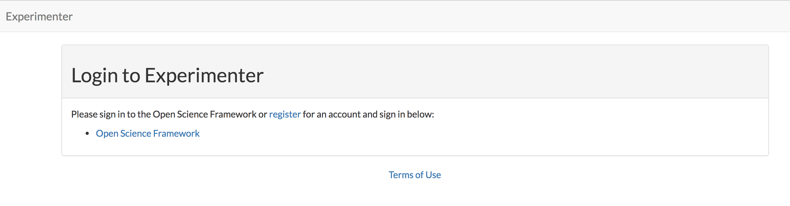

If you don't have an OSF account, click `register` to create one.
If you do have an OSF account, click the Open Science Framework link. Enter your OSF credentials.

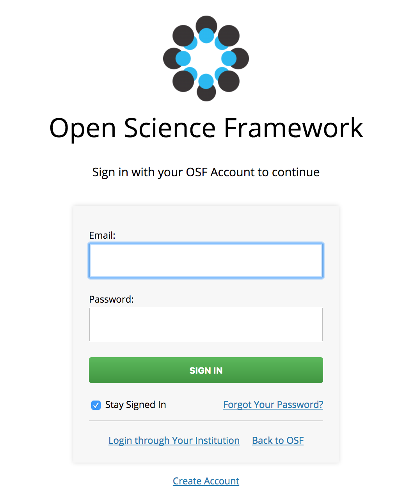

If you haven't yet been approved to join Experimenter, you'll receive a notification when this is done.

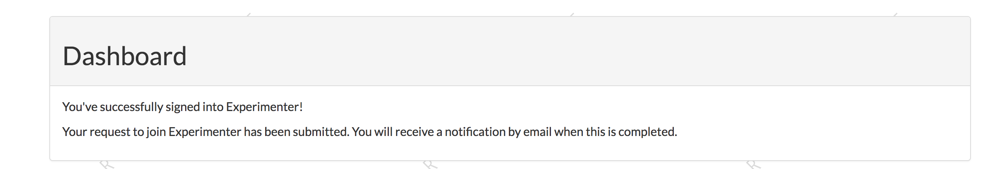

Otherwise, you will be logged into Experimenter.

Researcher accounts can also have children and demographic data, just like participants. If you would like to have a **separate** participant account on Lookit, use a different email address.

===========================
Managing your Organization
===========================
-----------------------------------------
Adding researchers to your organization
-----------------------------------------

Navigate to `Manage Organization` https://lookit.mit.edu/exp/researchers/.  Only users with organization admin and organization read permissions can view other researchers in the org.
The researchers displayed are researchers that currently belong to your organization, or researchers still needing approval.  Researchers awaiting approval have "No organization groups" listed as the permission.
Navigate to a researcher awaiting approval (only organization admins are permitted to do this).

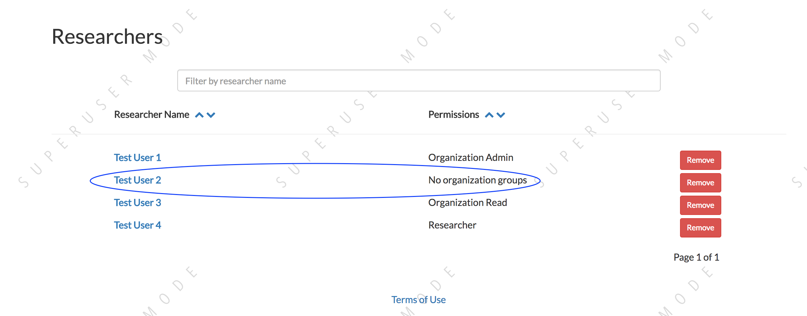

Under permissions at the bottom of the researcher detail page, select `Researcher`, `Organization Read`, or `Organization Admin` from the dropdown, and click the check mark.  This will give
that researcher the associated permissions and add them to your organization. They will receive an email notification.

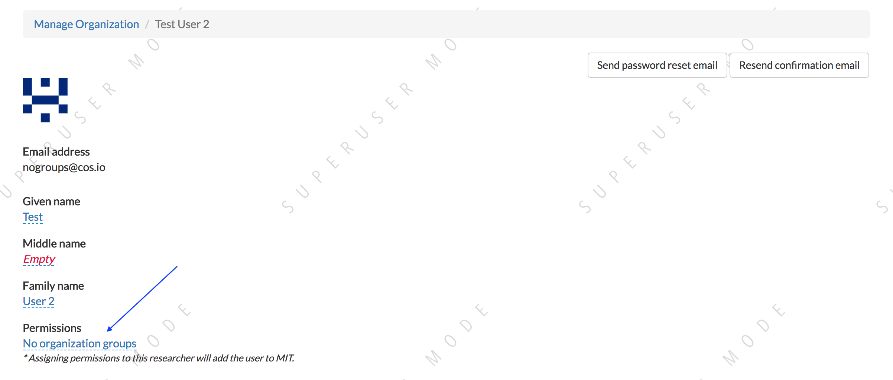

------------------------------------------------
Editing a researcher's organization permissions
------------------------------------------------
Navigate to a particular researcher's detail page https://lookit.mit.edu/exp/researchers/<researcher_id>.  Only organization admins can view this page. Under permissions at the bottom of the researcher detail page, select `Researcher`, `Organization Read`, or `Organization Admin` from the dropdown, and click the check mark.  This will modify
the researcher's permissions.

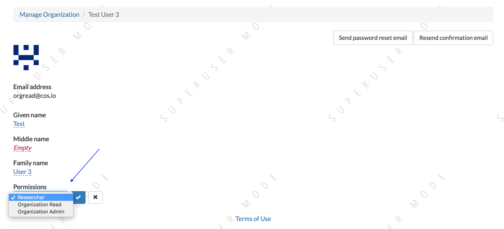

------------------------------------------------
Deleting a researcher's organization permissions
------------------------------------------------
Navigate to `Manage Organization` https://lookit.mit.edu/exp/researchers/. Only users with organization admin and organization read permissions can view other researchers in the org.  Click "Remove" beside the
researcher you wish to delete, and then click "Remove" again in the confirmation modal.  The researcher will be marked as inactive and will no longer be permitted to login to Experimenter.

.. image:: _static/img/deleting_a_researcher.png
    :alt: Deleting a researcher

====================
Managing Studies
====================
--------------------
Creating a study
--------------------
To create a study, navigate to https://lookit.mit.edu/exp/studies/create/. A researcher must have been added to an organization to add a study.
Here's an explanation of some the field names:

- *Name*: title of your study, must be <255 characters
- *Image*: Image that will be displayed to participants on Lookit Studies page.  File must be an image-type, and please keep the file size reasonable (<1 MB)
- *Exit URL*: Must enter a URL. After the participant has completed the study, we will direct them to the Exit URL.
- *Participant Eligibility*: Participant-facing eligibility string.  Make this readable so participants understand if their child can take part in the study.
- *Minimum/Maximum Age cutoffs*: Integer fields specifying minimum/maximum ages of participants (inclusive). Eligibility is calculated based on the child's current age in days; this is compared to the minimum/maximum ages in days, calculated as 365*years + 30*months + days. Participants under the age range see a warning indicating that their data may not be used, and suggesting that they wait until they're in the age range. Participants over the age range just see a warning indicating that their data may not be used. Participants are never actually prevented from starting the study, to remove motivation for a curious parent to fudge the child's age.
- *Discoverable* - Do you want to make this study public or not?  If marked discoverable, once the study is activated, it will appear on the Lookit site.
- *Build Study* - This needs to be a valid JSON block describing the different frames (pages) of your study, and the sequence. You can add these later under localhost:8000/exp/studies/<study_id>/edit/build/. For detailed information about specifying your study protocol, see `Building an Experiment`_.
- *Study Type* - The study type is the application you're using to enable participants to take a study. Right now, we just have one option, the `Ember Frame Player <https://github.com/CenterForOpenScience/ember-lookit-frameplayer>`_.  It's an ember app that can talk to our API. All the frames in the experiment are defined in Ember (found in exp-addons) and there is an exp-player component that can cycle through these frames.
    - The *addons_repo_url* is the repo where the frames and the player are stored.  This is the default addons_repo_url: https://github.com/centerforopenscience/exp-addons.  If you want to add new frames, fork this repo, and set the addons_repo_url to your fork.
    - The *last_known_addons_sha* is the commit of your addons_repo_url that you want to point to.  If you don't add this, it will point to the latest commit in the default branch of the repo at addons_repo_url. You can set the default in Github.
    - The *last_known_player_sha* is the commit of the ember app https://github.com/CenterForOpenScience/ember-lookit-frameplayer that talks to our API and passes that info onto the frame player. If you don't add this, it will point to the latest commit in the default branch.
    - **If you don't want any customization and want to use the existing player and frames, just select the defaults and press "Create study"**

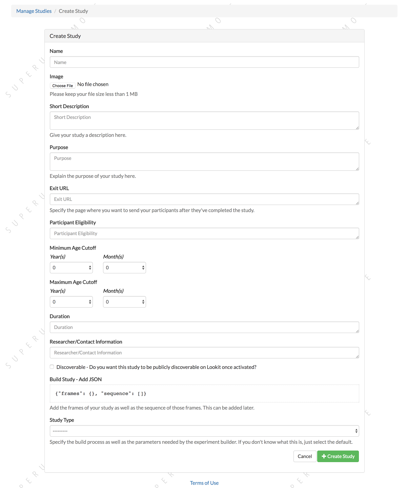

--------------------
Viewing study list
--------------------
To view all studies, navigate to https://lookit.mit.edu/exp/studies/.  A researcher must have been added to an organization to view this page.  From there, the researcher can only see studies they have permission to view.  Org admins and org reads can see all studies
that belong to their organization.  If the user is a basic researcher, they can only view studies to which they have been explicitly added.

You can filter studies by name or by keywords in the description. Additionally, you can sort on various study states like "Created" or "Submitted", or filter on your own studies by selecting "My Studies". You can also sort on study name, study end date, and study begin date.

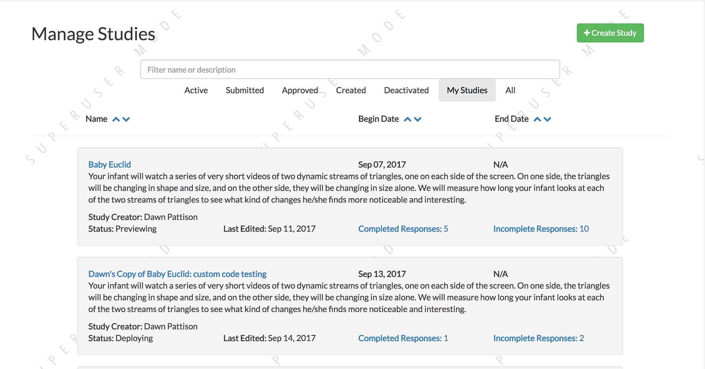

--------------------
Study detail page
--------------------
To view a single study, navigate to https://lookit.mit.edu/exp/studies/<study_id>.  A researcher must have permission to view this study specifically.  Org admins and org reads can view all studies in their organization.  A basic researcher can only view this study if they have been
explicitly added as a study admin or study read. At the top, you see many of the study details that you entered when you created the study.  The UUID is also displayed; this is the identifier that participants will see. You also have the option to navigate to View Responses, or to
clone the study.  Cloning will create a copy of the study but add the logged in user as the creator.  The clone will be moved back into "Created" status. Study logs of when the study
changed state are at the bottom of the page.

The only study detail that can be edited from this page is the study status.  The current status is displayed, as well as a dropdown with the available states, and a comments block.  Only users that have permission to edit the study state can make these changes, meaning organization
admins, or study admins.  The available states where you can move the study depend on what state is next in the sequence, as well as your current level of permissions.  For example, if a study's current state is "Created", that study
can only be "Submitted" for review, or "Archived", which removes the study from display.  Comments can only be left on the study if it is being rejected.  Only organization admins can approve or reject a study.

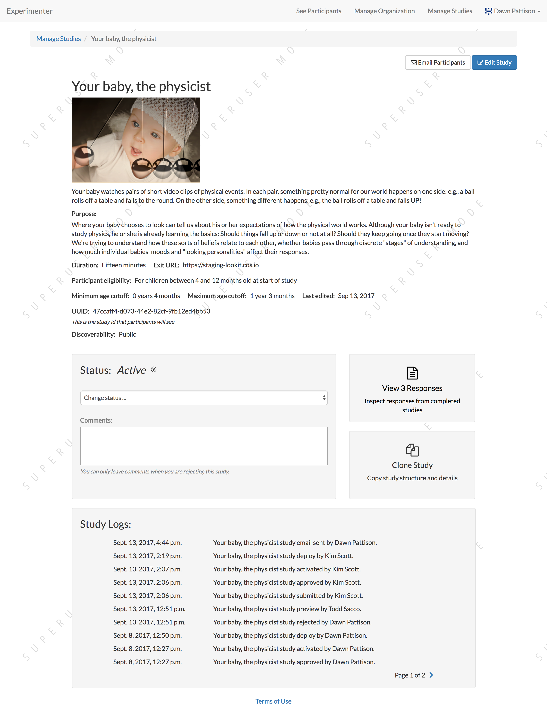

Your study's unique ID is displayed in this view.

--------------
Study states
--------------
All study states and explanations:

    - *created*: Study has been initially created, but has not been submitted for approval
    - *submitted*: Study is submitted and awaiting approval by an organization admin
    - *previewing*: Study is being built and deployed to Google Cloud Storage for previewing.  This can take awhile for the study to be built.
    - *approved*: Study has been approved by an organization admin to run on Lookit, but is not yet active
    - *deploying*: Study is currently being built and deployed to Google Cloud Storage. Once the study is deployed, the study will be marked active and will be available to study participants.
    - *active*: Study is active and can be collecting data. If the study is also marked "Discoverable", the study will show up on Lookit's study list.
    - *rejected*: The study has been rejected by an organization admin.  The study should be edited before resubmitting.
    - *retracted*: The study has been withdrawn by a study admin.
    - *paused*: Study is not actively collecting data or visible on Lookit
    - *deactivated*: Study is done collecting data
    - *archived*: Study has been archived and removed from search

--------------------
Study edit page
--------------------
On the study edit page, https://lookit.mit.edu/exp/studies/<study_id>/edit/ you can update much of the metadata about the study. You can only view this page if you have permission to edit this particular study, meaning org admins or study admins. At the top of the page, you can edit fields like Name, and Description.  See Creating a Study for more details.

To edit fields, change the information and click Save Changes in the middle of the page.  If your study has already been approved, then the save button will be red.  Otherwise it will be green. If your study has already been approved, then editing key details will automatically put the study in a rejected state.  You must resubmit your
study and get it approved again by an organization admin to run the study on the Lookit platform.

At the bottom of the edit study page, there is a Build Study link.  This will take you to https://lookit.mit.edu/exp/studies/<study_id>/edit/build, where you can make edits to your study's structure (the frames, or pages, in your experiment), and the sequence of those frames.  You can also make advanced edits to the commits we are using to build your study.

You can also change the study's status on this page. The current status is displayed, as well as a dropdown with the available states, and a comments block.  Only users that have permission to edit the study state can make these changes, meaning organization
admins, or study admins.  The available states where you can move the study depend on what state is next in the sequence, as well as your current level of permissions.  For example, if a study's current state is "Created", that study
can only be "Submitted" for review, or "Archived", which removes the study from display.  Comments can only be left on the study if it is being rejected.  Only organization admins can approve or reject a study.

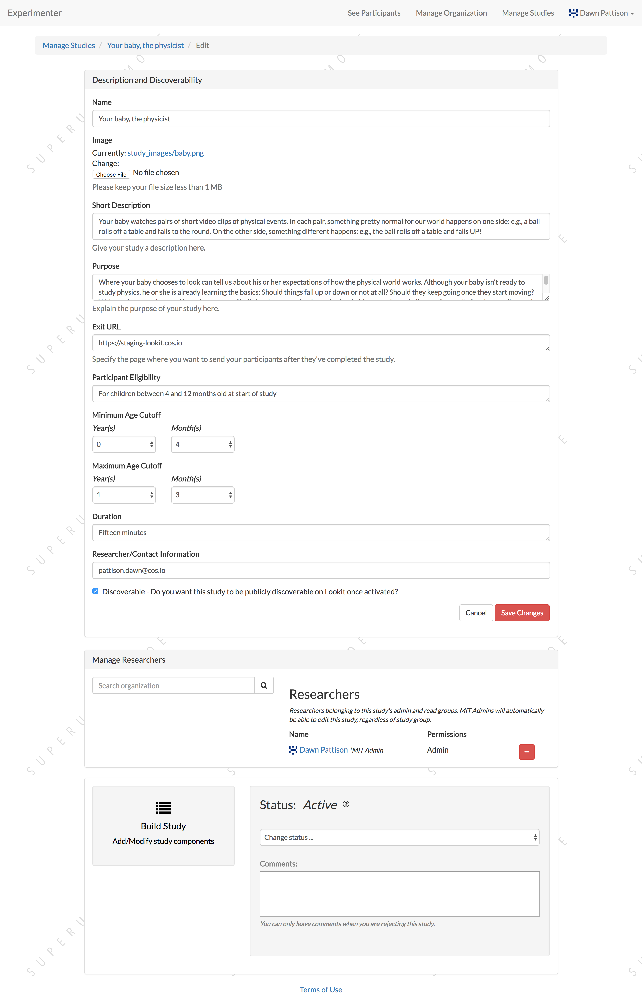

---------------------------------
Adding researchers to your study
---------------------------------
Halfway down the study edit page, https://lookit.mit.edu/exp/studies/<study_id>/edit/, you can see the researchers that have study admin or study read permissions to your study. You must have permissions to edit the study to view this page, meaning org admins or study admins. The study creator automatically has study admin permissions.
In the search box, you can filter researchers in your organization.

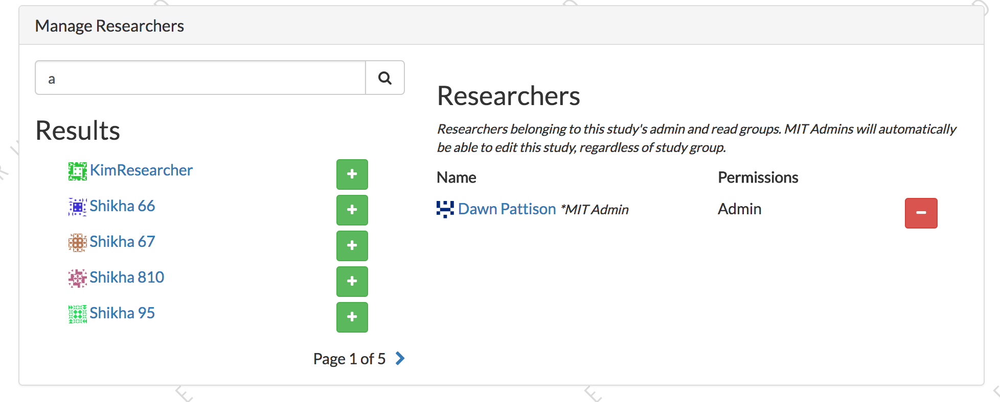

Click the green plus to add them to your study.  They are given study read permissions by default.  If the researcher you are adding happens to also be an organization admin, they will have admin permissions on your study.
These researchers that are also org admins are denoted by an asterisk, followed by the <name of your organization>-Admin.

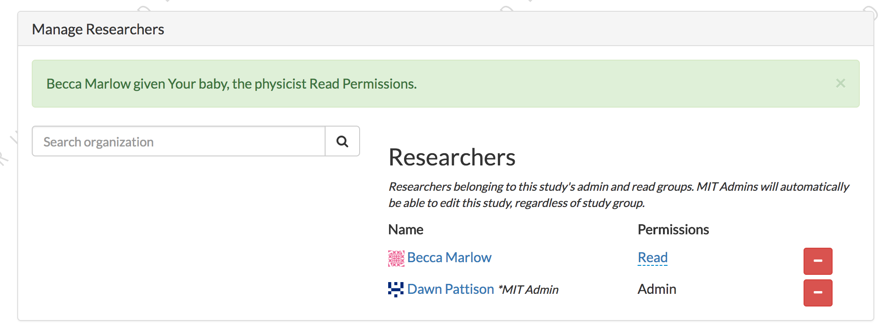

------------------------------------------
Editing researcher permissions on a study
------------------------------------------
To edit a researcher, select read or admin permissions in the dropdown beside the researcher name and click the checkmark.  This will automatically give the researcher read or admin permissions.  There must be one study admin at all times, so it's possible that you won't be able to make edits to permissions.

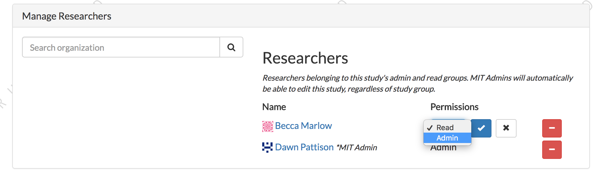

---------------------------------
Deleting researcher permissions
---------------------------------
To remove a researcher from a study, click the red minus button beside the researcher's name.  This will automatically remove the user's study admin or study read permissions. There must be one study admin at all times, so it's possible that you won't be able to remove a researcher.

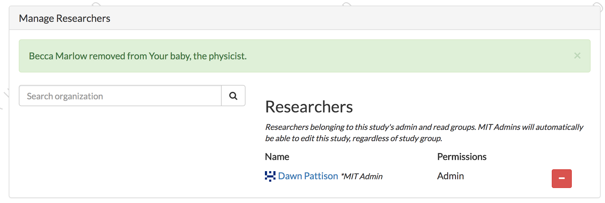

-------------------------
Editing study structure
-------------------------
For information about how to specify what happens during your study, see `Building an Experiment`_.

To edit a study's structure, navigate to https://lookit.mit.edu/exp/studies/<study_id>/edit/build/. You must be a study admin or org admin to view this page. From here, you can edit the study's structure and the study type.
The study structure specifies the frames (or pages) of your experiment, and also specifies the sequence.

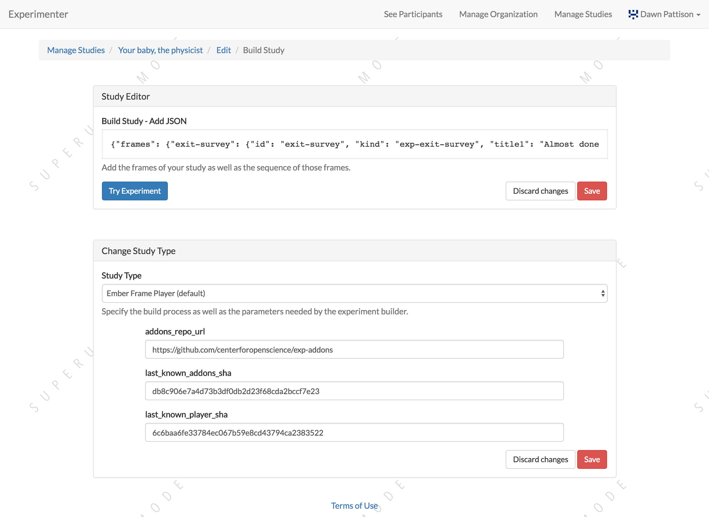

To edit the structure, click on the JSON block.  A JSON editor will appear.  Click on "Beautify" in the top right corner for better readability. Once you are happy with your changes click 'Close'.  Then hit "Save" in the bottom right corner.
If your study has already been approved, then clicking "Save" will automatically reject the study. You will have to resubmit it for an organization admin to reapprove.

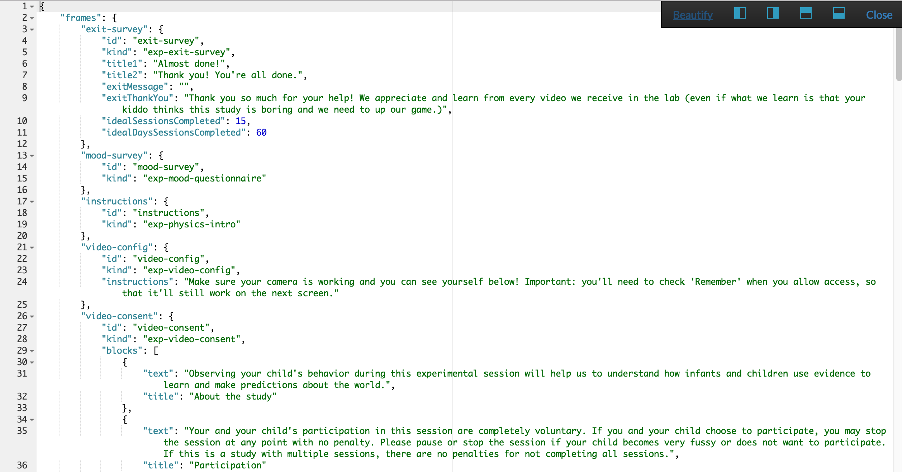

If you wish to preview your study, click "Try Experiment".  You will get an email 7-10 minutes later, possibly longer, with a link to preview your study.  We are building the study and putting on Google Cloud Storage for you to preview. These builds,
though not instantaneous, keeps the studies separate from one another.  These studies are all pulling from common code, so it is possible that someone edits a frame, and that edit breaks someone else's study. By storing builds on Google Cloud Storage,
pointing to specific commits, we can keep edits to frames from unintentionally breaking another study.

-------------------------
Editing study type
-------------------------
To edit a study's type, navigate to https://lookit.mit.edu/exp/studies/<study_id>/edit/build/.

The study type is the application you're using to enable participants to take a study. Right now, we just have one option, the `Ember Frame Player <https://github.com/CenterForOpenScience/ember-lookit-frameplayer>`_.  It's an ember app that can talk to our API. All the frames in the experiment are defined in Ember (found in exp-addons) and there is an exp-player component that can cycle through these frames.
    - The *addons_repo_url* is the repo where the frames and the player are stored.  This is the default addons_repo_url: https://github.com/centerforopenscience/exp-addons.  If you want to add new frames, fork this repo, and set the addons_repo_url to your fork.
    - The *last_known_addons_sha* is the commit of your addons_repo_url that you want to point to.  If you don't add this, it will point to the latest commit in the default branch of the repo at addons_repo_url. You can set the default in Github.
    - The *last_known_player_sha* is the commit of the ember app https://github.com/CenterForOpenScience/ember-lookit-frameplayer that talks to our API and passes that info onto the frame player. If you don't add this, it will point to the latest commit in the default branch.
    - **If you don't want any customization and want to use the existing player and frames, just select the defaults and press "Create study"    -** These are advanced options! If you want to use existing frames, and the existing player, just leave the defaults as-is.

-----------------------------------
Viewing Individual Study Responses
-----------------------------------
For information about interpreting study responses, see `Experiment data`_.

To view a study's response, navigate to https://lookit.mit.edu/exp/studies/<study_id>/responses/.  You must have permission to view this study's responses, which means you must be an Organization Admin, Organization Read, or belong to the Study Admin or Study Read groups.

On the left, you have a list of participants that have responded to your study, with the response id, the study's completion status, and the date it was modified. When you click on a participant, the JSON of that participant's response is shown on the right.  You can
download the individual participant's JSON response by clicking "Download Individual Response JSON".  Alternatively, you can select CSV in the dropdown, and click "Download Individual Response CSV".

Beneath the CSV/JSON response data, are the individual video attachments that are linked to that participant's response, if they exist.  If you expect to see video attachments, and there are none,
there are often slight delays in copying the videos to be viewed through Experimenter.

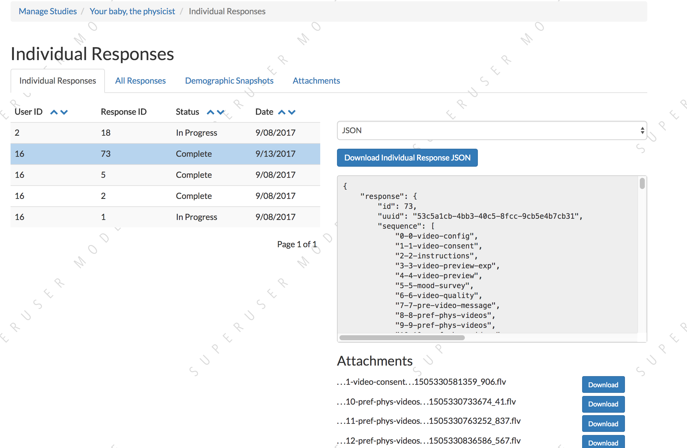

------------------------------
Viewing all study responses
------------------------------
To view all of the responses to a study, navigate to https://lookit.mit.edu/exp/studies/<study_id>/responses/all/. You must have permission to view this study's responses, which means you must be an Organization Admin, Organization Read, or belong to the Study Admin or Study Read groups.

By default, all study responses are displayed in JSON format.  To download as CSV, select CSV in the dropdown and download.  The study response data is supplemented with the study id, participant ids and nickname, and the associated child info.

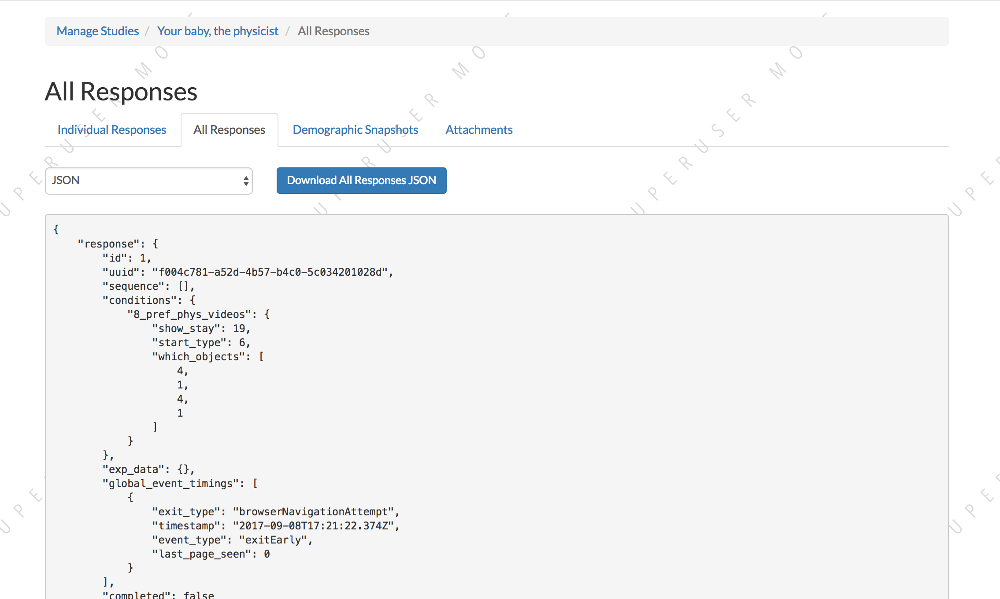

-------------------------------------------
Viewing demographics of study participants
-------------------------------------------
To view the demographics of participants that have responded to your study, navigate to https://lookit.mit.edu/exp/studies/<study_id>/responses/demographics. You must have permission to view this study's responses, which means you must be an Organization Admin, Organization Read, or belong to the Study Admin or Study Read groups.

This list is generated by looping through all the responses to your study, and displaying the demographics of the associated participant.  If a participant has responded multiple times, the demographics will appear multiple times.  Demographic data was versioned, so the demographics associated with each
response will be the demographics that were current at the time the participant responded to the study.  You can download the demographics in JSON or CSV format.

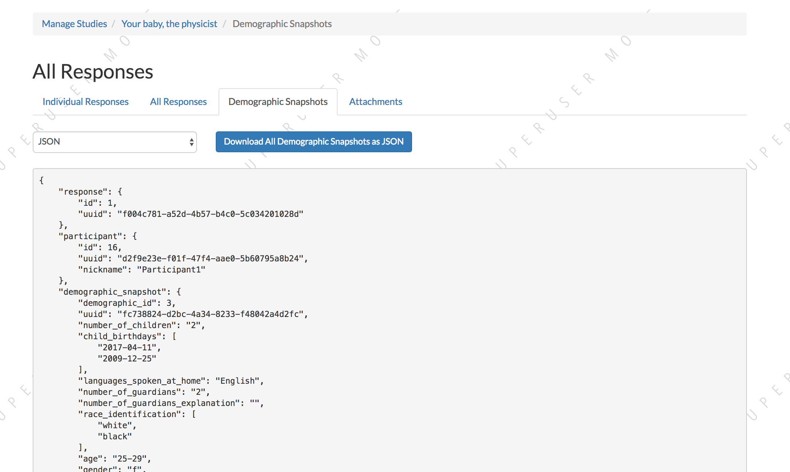

----------------------------------------
Viewing all study attachments
----------------------------------------
To view all video responses to your study, navigate to https://lookit.mit.edu/exp/studies/<study_id>/responses/attachments/.
You can filter on video attachment name. The format of the video names is `videoStream_{study_id}_{frame_name}_{response_id}.mp4`

Video attachments can be downloaded individually.  You also have the option of bulk downloading all consent videos for your study, or bulk downloading all responses.
The bulk download will take place asynchronously, so once the videos have been downloaded and put in a zip file, you will get an email telling you this is done.

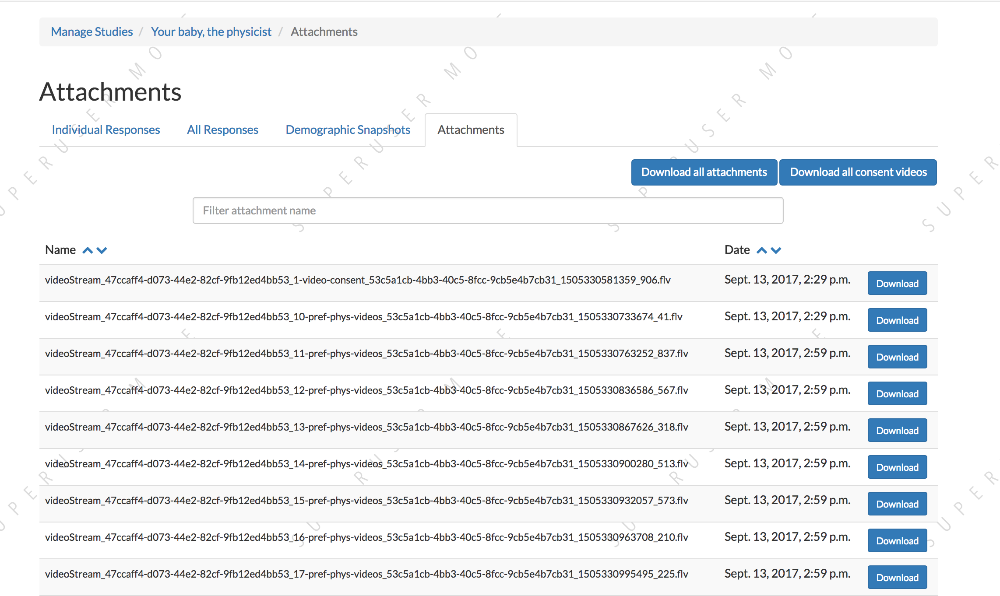

.. _`Building an Experiment`: experiments.html

.. _`Experiment data`: experimentdata.html
