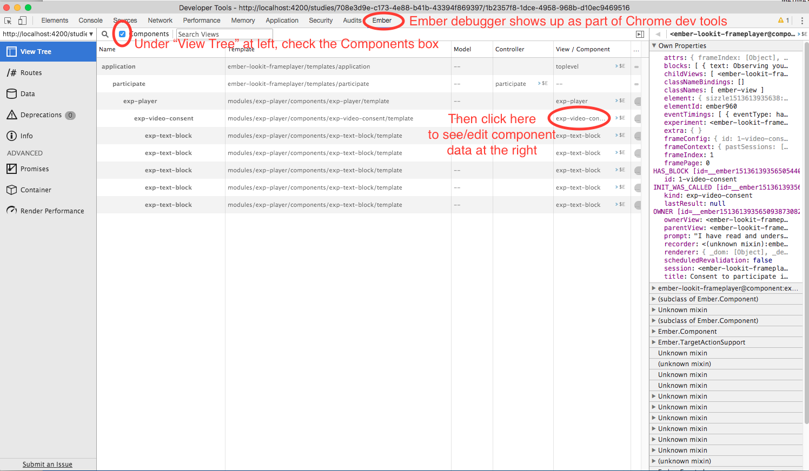
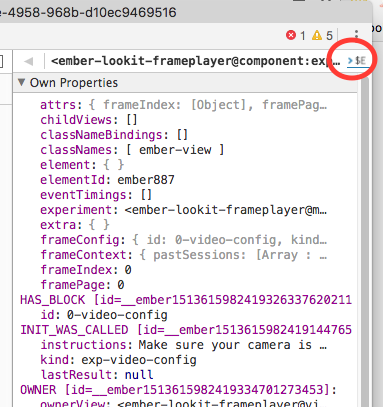
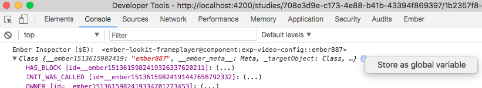

Development: Custom Frames
==========================

Overview
~~~~~~~~

You may find you have a need for some experimental component not already
included in Lookit. The goal of this section is to walk through
extending the base functionality with your own code.

We use the term ‘frame’ to describe the combination of JavaScript file
and Handlebars HTML template that compose a **block** of an experiment
(see “Building your experiment”).

Experimenter is composed of three main modules:

-  `lookit-api <https://github.com/CenterForOpenScience/lookit-api>`__:
   The repo containing the Experimenter Django app. The Lookit Django
   app is also in this repo.
-  `ember-lookit-frameplayer <https://github.com/CenterForOpenScience/ember-lookit-frameplayer>`__:
   A small Ember app that allows the API in lookit-api to talk to the
   exp-player
-  `exp-player <https://github.com/CenterForOpenScience/exp-addons/tree/develop/exp-player>`__:
   the built-in rendering engine for experiments built in Experimenter.
   Contained in exp-addons.

Generally, all ‘frame’ development will happen in the exp-player module.
By nature of the way the ember-lookit-frameplayer repository is
structured, this will mean making changes in the
``ember-lookit-frameplayer/lib/exp-player`` directory. These changes can
be committed as part of the
`exp-addons <https://github.com/CenterForOpenScience/exp-addons>`__ git
submodule (installed under ``ember-lookit-frameplayer/lib``).

To start developing your own frames, you will want to first follow the
“Setup for local frame development” steps. To use the frame definitions
you have created when posting a study on Lookit, you can specify your
own exp-addons repo to use (see “Using the experimenter interface”).

Getting Started
~~~~~~~~~~~~~~~

One of the features of `Ember CLI <http://www.ember-cli.com/>`__ is the
ability to provide ‘blueprints’ for code. These are basically just
templates of all of the basic boilerplate needed to create a certain
piece of code. To begin developing your own frame:

.. code:: bash

   cd ember-lookit-frameplayer/lib/exp-player
   ember generate exp-frame exp-<your_name>

Where ``<your_name>`` corresponds with the frame name of your choice.

A Simple Example
^^^^^^^^^^^^^^^^

Let’s walk though a basic example of ‘exp-consent-form’:

.. code:: bash

   $ ember generate exp-frame
   installing exp-frame
     create addon/components/exp-consent-form/component.js
     create addon/components/exp-consent-form/template.hbs
     create app/components/exp-consent-form.js

Notice this created three new files: -
``addon/components/exp-consent-form/component.js``: the JS file for your
‘frame’ - ``addon/components/exp-consent-form/template.hbs``: the
Handlebars template for your ‘frame’ -
``app/components/exp-consent-form.js``: a boilerplate file that exposes
the new frame to the Ember app- you will almost never need to modify
this file.

Let’s take a deeper look at the ``component.js`` file:

.. code:: javascript

   import ExpFrameBaseComponent from 'exp-player/components/exp-frame-base/component';
   import layout from './template';

   export default ExpFrameBaseComponent.extend({
       type: 'exp-consent-form',
       layout: layout,
       meta: {
           name: 'ExpConsentForm',
           description: 'TODO: a description of this frame goes here.',
           parameters: {
               type: 'object',
               properties: {
                   // define configurable parameters here
               }
           },
           data: {
               type: 'object',
               properties: {
                   // define data to be sent to the server here
               }
           }
       }
   });

The first section:

.. code:: javascript

   import ExpFrameBaseComponent from 'exp-player/components/exp-frame-base';
   import layout from './template';

   export default ExpFrameBaseComponent.extend({
       type: 'exp-consent-form',
       layout: layout,
   ...
   })

does several things: - imports the ``ExpFrameBaseComponent``: this is
the superclass that all ‘frames’ must extend - imports the ``layout``:
this tells Ember what template to use - extends
``ExpFrameBaseComponent`` and specifies ``layout: layout``

Next is the ‘meta’ section:

.. code:: javascript

       ...
       meta: {
           name: 'ExpConsentForm',
           description: 'TODO: a description of this frame goes here.',
           parameters: {
               type: 'object',
               properties: {
                   // define configurable parameters here
               }
           },
           data: {
               type: 'object',
               properties: {
                   // define data to be sent to the server here
               }
           }
       }
   ...

which is composed of: - name (optional): A human readable name for this
‘frame’ - description (optional): A human readable description for this
‘frame’. - parameters: JSON Schema defining what configuration
parameters this ‘frame’ accepts. When you define an experiment that uses
the frame, you will be able to specify configuration as part of the
experiment definition. Any parameters in this section will be
automatically added as properties of the component, and directly
accessible as ``propertyName`` from templates or component logic. -
data: JSON Schema defining what data this ‘frame’ outputs. Properties
defined in this section represent properties of the component that will
get serialized and sent to the server as part of the payload for this
experiment. You can get these values by binding a value to an input box,
for example, or you can define a custom computed property by that name
to have more control over how a value is sent to the server.

If you want to save the value of a configuration variables, you can
reference it in both parameters *and* data. For example, this can be
useful if your experiment randomly chooses some frame behavior when it
loads for the user, and you want to save and track what value was
chosen.

It is important that any fields you define in ``data`` be named in
camelCase: they can be all lowercase or they can be writtenLikeThis, but
they should not start with capital letters or include underscores. This
is because the fields from the Ember app will be converted to snake_case
for storage in the Postgres database, and may be converted back if
another frame in Ember uses values from past sessions. We are fine if we
go ``fieldName`` -> ``field_name`` -> ``fieldName``, but anything else
gets dicey! (Note to future developers: some conversations about this
decision are available if this becomes a point of concern.)

Building out the Example
^^^^^^^^^^^^^^^^^^^^^^^^

Let’s add some basic functionality to this ‘frame’. First define some of
the expected parameters:

.. code:: javascript

   ...
       meta: {
           ...,
           parameters: {
               type: 'object',
               properties: {
                   title: {
                       type: 'string',
                       default: 'Notice of Consent'
                   },
                   body: {
                       type: 'string',
                       default: 'Do you consent to participate in this study?'
                   },
                   consentLabel: {
                       type: 'string',
                       default: 'I agree'
                   }
               }
           }
       },
   ...

And also the output data:

.. code:: javascript

   ...,
       data: {
           type: 'object',
               properties: {
                   consentGranted: {
                       type: 'boolean',
                       default: false
                   }
               }
           }
       }
   ...

Since we indicated above that this ‘frame’ has a ``consentGranted``
property, let’s add it to the ‘frame’ definition:

.. code:: javascript

   export default ExpFrameBaseComponent.extend({
       ...,
       consentGranted: null,
       meta: {
       ...
       }
   ...

Next let’s update ``template.hbs`` to look more like a consent form:

::

   

     <h1>{{ title }}</h1>
     

     
 {{ body }}

     

     

       
         {{ consentLabel }}
       
       {{input type="checkbox" checked=consentGranted}}
     

   

   

     <!-- Next/Last/Previous controls. Modify as appropriate -->
     

       <button class="btn btn-default" {{ action 'previous' }} > Previous </button>
       <button class="btn btn-default pull-right" {{ action 'next' }} > Next </button>
     

   

We don’t want to let the participant navigate backwards or to continue
unless they’ve checked the box, so let’s change the footer to:

::

   

     

       <button class="btn btn-default pull-right" disabled={{ consentNotGranted }} {{ action 'next' }} > Next </button>
     

   

Notice the new property ``consentNotGranted``; this will require a new
computed field in our JS file:

.. code:: javascript

       meta: {
           ...
       },
       consentNotGranted: Ember.computed.not('consentGranted')
   });

Adding CSS styling
~~~~~~~~~~~~~~~~~~

You will probably want to add custom styles to your frame, in order to
control the size, placement, and color of elements. Experimenter uses a
common web standard called
`CSS <https://developer.mozilla.org/en-US/docs/Web/CSS>`__ for styles.\*

To add custom styles for a pre-existing component, you will need to
create a file ``<component-name.scss>`` in the
``addon/styles/components`` directory of ``exp-addons``. Then add a line
to the top of ``addon/styles/addon.scss``, telling it to use that style.
For example,

``@import "components/exp-video-physics";``

Remember that anything in exp-addons is shared code. Below are a few
good tips to help your addon stay isolated and distinct, so that it does
not affect other projects.

-  To protect other frames from being affected by your new styles, add a
   class of the same name as your frame (e.g., ``exp-myframe``) to the
   div enclosing your component. Then prefix *every* rule in your .scss
   file with ``.exp-myframe`` to ensure that only your own frame is
   affected. Until we have a better solution, this practice will be
   enforced if you submit a pull request to add your frames to the
   common Lookit exp-addons repo.

-  To help protect your *own* frame’s styling from possible future style
   changes (improperly) added by other people, you can give new classes
   and IDs in your component a unique prefix, so that they don’t
   inadvertently overlap with styles for other things. For example,
   instead of ``video-widget`` and ``should-be-centered``, use names
   like ``exp-myframe-video-widget`` and
   ``exp-myframe-should-be-centered``.

\* You may notice that style files have a special extension ``.scss``.
That is because styles in experimenter are actually written in
`SASS <http://sass-lang.com/>`__. You can still write normal CSS just
fine, but SASS provides additional syntax on top of that and can be
helpful for power users who want complex things (like variables).

Using mixins
~~~~~~~~~~~~

Sometimes, you will wish to add a preset bundle of functionality to any
arbitrary experiment frame. The Experimenter platform provides support
for this via *mixins*.

To use a mixin for video recording, fullscreen, etc., simply have your
frame “extend” the mixin. For instance, to use the VideoRecord mixin,
your component.js file would define:

.. code:: javascript

   import ExpFrameBaseComponent from 'exp-player/components/exp-frame-base/component';
   import layout from './template';

   export default ExpFrameBaseComponent.extend(VideoRecord, {
       type: 'exp-consent-form',
       layout: layout,
       meta: {
           ...
       }
   });

Your frame can extend any number of mixins. For now, be careful to
check, when you use a mixin, that your frame does not defining any
properties or functions that will conflict with the mixin’s properties
or functions. If the mixin has a function ``doFoo``, you can use that
from your frame simply by calling ``this.doFoo()``.

Below is a brief introduction to each of the common mixins; for more
detail, see sample usages throughout the exp-addons codebase and the
mixin-specific docs
`here <https://lookit.github.io/exp-addons/modules/mixins.html>`__

FullScreen
^^^^^^^^^^

This mixin is helpful when you want to show something (like a video) in
fullscreen mode without distractions. You will need to specify the part
of the page that will become full screen. By design, most browsers
require that you interact with the page at least once before full screen
mode can become active.

MediaReload
^^^^^^^^^^^

If your component uses video or audio, you will probably want to use
this mixin. It is very helpful if you ever expect to show two
consecutive frames of the same type (eg two physics videos, or two
things that play an audio clip). It automatically addresses a quirk of
how ember renders the page; see `stackoverflow
post <http://stackoverflow.com/a/18454389/1422268>`__ for more
information.

VideoRecord
^^^^^^^^^^^

Functionality related to video capture, in conjunction with the
`Pipe <https://addpipe.com>`__ system, for which MIT has a license.

Documenting your frame
~~~~~~~~~~~~~~~~~~~~~~

We use `YUIdoc <http://yui.github.io/yuidoc/>`__ for generating
“automatic” documentation of exp-addons frames, available
`here <https://lookit.github.io/exp-addons/modules/frames.html>`__. If
you want to contribute your frames to the main Lookit codebase, please
include YUIdoc-formatted comments following the example of existing
frames, e.g. ``exp-lookit-exit-survey``. Make sure to include:

-  A general description of your frame
-  An example of using it (the relevant JSON for a study)
-  All inputs
-  All outputs (data saved)
-  Any events recorded

Ember debugging
~~~~~~~~~~~~~~~

Values of variables used in your frame are tricky to access directly
from the Javascript console in your browser during testing.

There’s an `Ember Inspector browser
plugin <https://guides.emberjs.com/v2.11.0/ember-inspector/>`__ you can
use to help debug the Lookit components. Once you’ve installed it,
you’ll find it along with other developer tools.

Here’s how to find relevant data for a particular frame. Screenshots
below are for Google Chrome.

   Ember debugger tree view

This lets you right away change any of the data you sent to the frame in
the JSON document. E.g., on the consent page, try changing the “prompt”
to something else. If something is going wrong, hopefully this
information will be helpful.

You can send the entire component (or anything else) to the console
using the little >$E button:

   Ember debugger send to console

And then to keep using it, save it as a variable:

   Ember debugger save variable

Then you can do things like try out actions, e.g. ``this.send``.

When should I use actions vs functions?
~~~~~~~~~~~~~~~~~~~~~~~~~~~~~~~~~~~~~~~

Actions should be used when you need to trigger a specific piece of
functionality via user interaction: eg click a button to make something
happen.

Functions (or helper methods on a component/frame) should be used when
the logic is shared, or not intended to be accessed directly via user
interaction. It is usually most convenient for these methods to be
defined as a part of the component, so that they can access data or
properties of the component. Since functions can return a value, they
are particularly helpful for things like sending data to a server, where
you need to act on success or failure in order to display information to
the user. (using promises, etc)

Usually, you should use actions only for things that the user directly
triggers. Actions and functions are not mutually exclusive! For example,
an action called ``save`` might call an internal method called
``this._save`` to handle the behavior and message display consistently.

If you find yourself using the same logic over and over, and it does not
depend on properties of a particular component, consider making it a
`util <https://ember-cli.com/extending/#detailed-list-of-blueprints-and-their-use>`__!

If you are building extremely complex nested components, you may also
benefit from reading about closure actions. They can provide a way to
act on success or failure of something, and are useful for : - `Ember
closure actions have return
values <https://alisdair.mcdiarmid.org/ember-closure-actions-have-return-values/>`__
- `Ember.js Closure Actions Improve the Former Action
Infrastructure <https://spin.atomicobject.com/2016/06/25/emberjs-closure-actions/>`__
